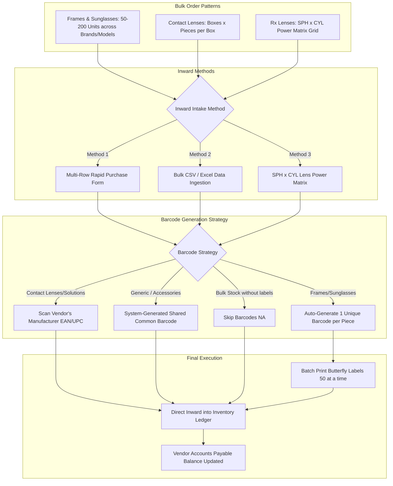

# Bulk Vendor Order & Inward Workflow Guide

**Reference Target:** https://india.opticalcrm.com/  
**Source Pages:**
- `page=master-import-data` (Import Data From Excel)
- `page=purchase-add` (Manual Multi-Row Purchase Inward)
- `page=purchase-generate-barcode` (Batch Barcode Generation)
- `page=purchase-print-barcode` (Batch Label Printing)
- `page=inventory-lens-grid` (Lens SPH x CYL Power Matrix)

---

## 1. Overview: How Bulk Ordering from Vendors Works

In the optical retail business, stores purchase products from vendors in three main bulk patterns:

---

## 2. Inward Intake Methods

### Method 1: Bulk CSV / Excel Import (`page=master-import-data`)
When a vendor (e.g. Luxottica, Safilo, Essilor, Bausch & Lomb) delivers an invoice with dozens or hundreds of items, the store can import the shipment in bulk:
1. **Template Selection**: User selects the import type:
   - `Purchases` (Direct inward bill from vendor)
   - `Frame Inventory` / `Sunglasses Inventory`
   - `Lens (Glass) Inventory`
   - `Contact Lens Inventory`
   - `Challan` (Consignment delivery without immediate bill)
2. **Column Structure**:
   - `Supplier Name`: Matches vendor directory.
   - `Purchase Bill Number`: Vendor's invoice number.
   - `Product Type`: `1=Frame`, `2=Lens`, `3=Sunglasses`, `4=Contact Lens`, `5=Solution`, `6=Other`.
   - `Model / Product Name`, `Brand`, `Color`, `Size`, `Quantity`.
   - `Purchase Price`: Net purchase price per unit after discount, including tax.
   - `Retail Price (MRP)` & `Selling Price`.
   - `Barcode`: Rule for barcode generation (Blank, SGC, Custom, or NA).
3. **Direct Paste Upload**: Instead of complicated file upload dialogs, the user copies the raw CSV text from Excel/Notepad, pastes it into the web text area (`#importData`), and clicks **Submit**.

---

### Method 2: Contact Lens Box Math
Contact lenses are ordered from vendors in **boxes**, but sold to patients in **boxes or individual blister packs**:
- In the bulk import/purchase form:
  - **`No Of Boxes`** (e.g., 10 boxes)
  - **`Pieces Per Box`** (e.g., 30 pieces)
  - **Total Pieces Calculated**: $10 \times 30 = 300\text{ pieces}$.
- **Pricing Rule**: Purchase Price, MRP, and Selling Price are entered **per box**.
- The CRM automatically divides the box price by pieces per box to store unit cost and value per piece in the database.

---

### Method 3: Rx Lens SPH $\times$ CYL Matrix Grid
When ordering stock lenses (e.g., 1.56 Blue Cut single vision lenses from Essilor/Zeiss):
- Lenses are delivered in a large matrix of sphere and cylinder combinations (e.g., SPH -6.00 to +4.00, CYL 0.00 to -2.00).
- The store opens the **Lens Grid Matrix** and fills in quantities in each cell.
- **`isPairWise` Rule**:
  - If `isPairWise = "Yes"`, the system automatically doubles the quantity (e.g. 1 pair = 2 pieces) and halves the unit purchase and sales prices.

---

## 3. How Barcodes Work for Bulk Orders

When 200 items arrive in a single vendor order, how are barcodes handled?

| Barcode Strategy | How to Specify in Bulk | When Used | System Behavior |
| :--- | :--- | :--- | :--- |
| **Unique Barcode per Piece** | Leave `Barcode` column **BLANK** | **Frames & Sunglasses** | If 50 frames arrive, the system generates 50 distinct barcodes (e.g. `BOS-14-001` to `BOS-14-050`). Each frame gets its own individual butterfly tag. |
| **Manufacturer / Vendor Barcode** | Enter the manufacturer EAN/UPC (e.g. `8901030582918`) | **Contact Lens & Solutions** | Uses the pre-printed barcode already on the vendor's retail packaging. No need to print new stickers! |
| **Shared Common Barcode (`SGC`)** | Enter **`SGC`** | **Generic Accessories / Microfiber Cloths** | Generates 1 single barcode shared across all 100 units of that SKU. |
| **No Barcode (`NA`)** | Enter **`NA`** | **Bulk Non-Chargeable / Clinic Supplies** | Inwarded directly to stock count without creating any barcode records. |

---

## 4. Batch Sticker Printing (`page=purchase-generate-barcode` & `page=purchase-print-barcode`)
- Newly imported bulk items with auto-generated barcodes enter the **Pending Barcode Queue**.
- In the reference CRM:
  - Table shows: `Supplier`, `Purchase Bill #`, `Product Code`, `Description`, `Purchase Price`, `Sales Price`.
  - User selects items with checkboxes (batch limit of **50 to 100 barcodes** at a time to prevent thermal printer driver memory buffers from crashing).
  - Clicks **`Generate Barcode Number`** $\rightarrow$ moves to **Print Barcodes**.
  - Prints directly to a **Thermal Barcode Printer** (using `90x12 mm` butterfly labels for frames or standard thermal roll stickers).

---

## 5. Financial & Stock Impact
Once the bulk order is submitted:
1. **Inventory Ledger**: Automatically records `PURCHASE` inward movement, incrementing stock balances across branches.
2. **Vendor Accounts Payable**: Creates a payable balance under the Vendor's ledger for the total bill amount `(Net Amount = Subtotal - Discounts + GST)`.
3. **Audit Trail**: Every single item's barcode is permanently tagged with `Vendor Name` + `Purchase Bill #` + `Cost Price`.
