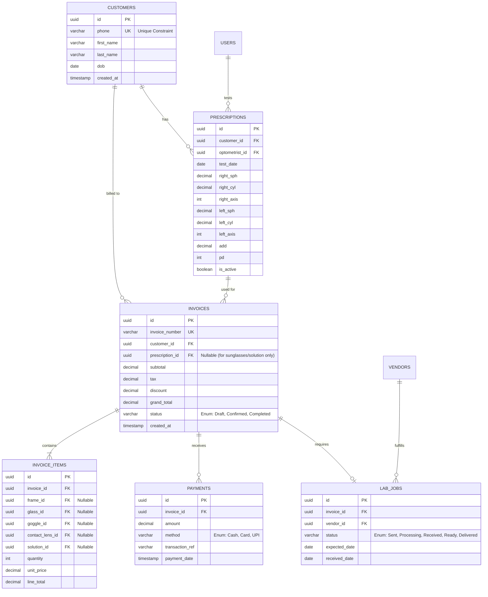

# Fully Normalized Optical ERP Database Schema

To strictly enforce **No Redundancy (3NF)**, **No Data Leaks**, and **Referential Integrity**, here is the proposed database architecture for the new modules. 

> [!IMPORTANT]
> **Strict Normalization Rules Applied:**
> 1. **No Data Duplication:** Customer details are stored exactly once. Invoices only reference the customer ID.
> 2. **No Polymorphic Leaks:** Instead of a generic `product_id` that can't be strictly enforced by the database, `invoice_items` uses specific Foreign Keys for each product type with a `CHECK` constraint ensuring exactly one is filled.
> 3. **Financial Integrity:** Total amounts in invoices are derived/validated against `invoice_items`. Payments are tracked in a separate ledger table to allow partial/split payments without hacking invoice columns.

---

## Entity-Relationship Diagram

---

## Table Breakdown & Constraints

### 1. `customers`
*   **Why it's normalized:** Phone numbers are marked as `UNIQUE`. This prevents the staff from accidentally creating multiple profiles for the same person, preventing data fragmentation.

### 2. `prescriptions`
*   **Why it's normalized:** Prescriptions are separated from the Customer table because a customer will have *many* prescriptions over their lifetime. 
*   **Data Leak Prevention:** Contains an `optometrist_id` (linking to your staff `users` table) for strict audit trails of who performed the test.

### 3. `invoices`
*   **Why it's normalized:** Only stores the mathematical totals. It links to `customer_id` and `prescription_id`. If the customer changes their name/phone, the invoice automatically reflects the correct data because it references the customer table (No update anomalies).

### 4. `invoice_items` (The Bridge to your Existing Inventory)
*   **Data Integrity Check:** To avoid "orphaned" or "ghost" products, we do NOT use a generic `product_id`. Instead, we create a strict Foreign Key mapping to your *existing* inventory tables (`frame_id`, `glass_id`, etc.). 
*   **Constraint:** A database-level constraint ensures that `(frame_id IS NOT NULL) + (glass_id IS NOT NULL) ... == 1`. An item line can only be *one* thing.

### 5. `payments` (Financial Ledger)
*   **Why it's normalized:** Instead of putting `advance_paid` and `balance` in the `invoices` table (which breaks down if a customer pays in 3 installments), we use a separate `payments` table. Total paid is always exactly `SUM(amount) WHERE invoice_id = X`.

### 6. `lab_jobs` & `vendors`
*   **Why it's normalized:** Separates the "manufacturing/fitting" workflow from the "billing" workflow. The invoice might be paid in full, but the lab job might be delayed. These states operate independently.
