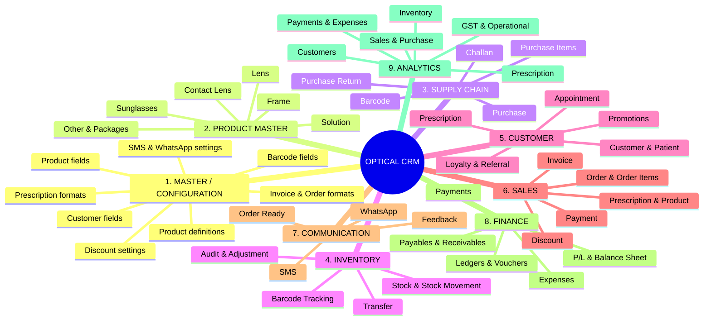
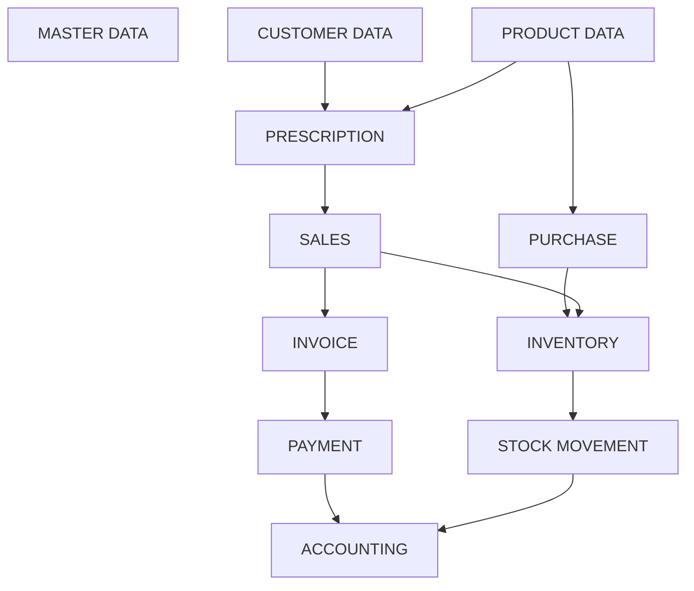
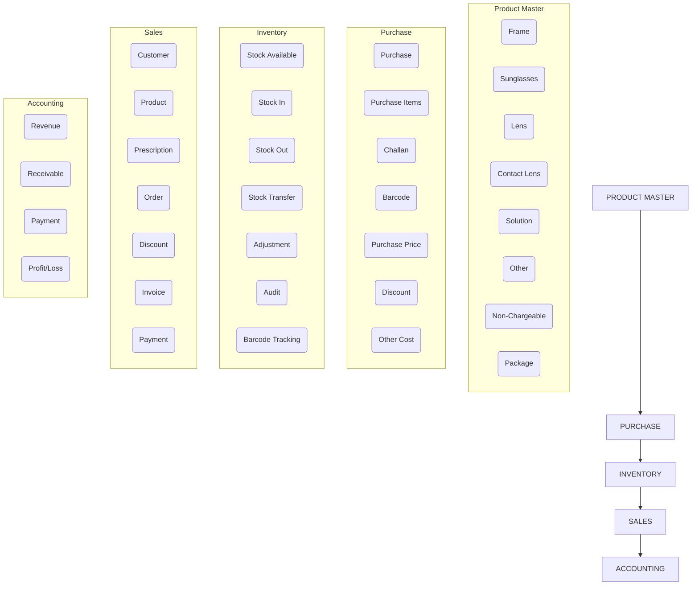
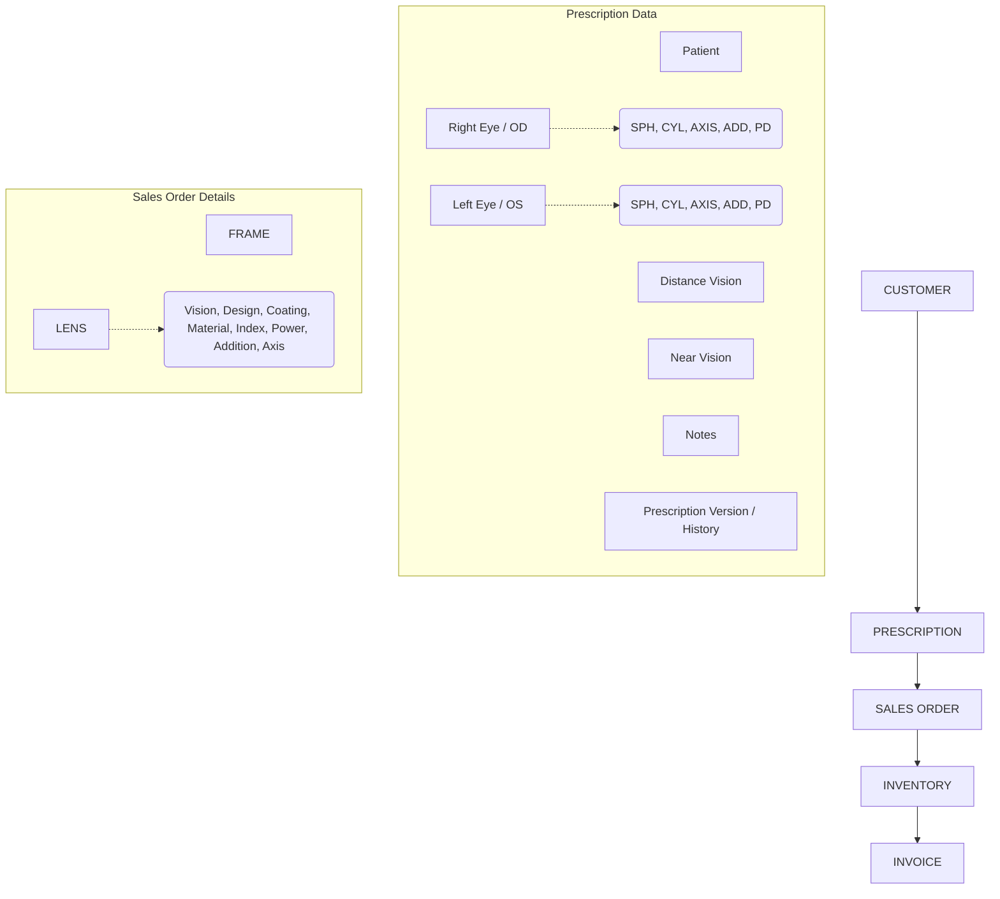
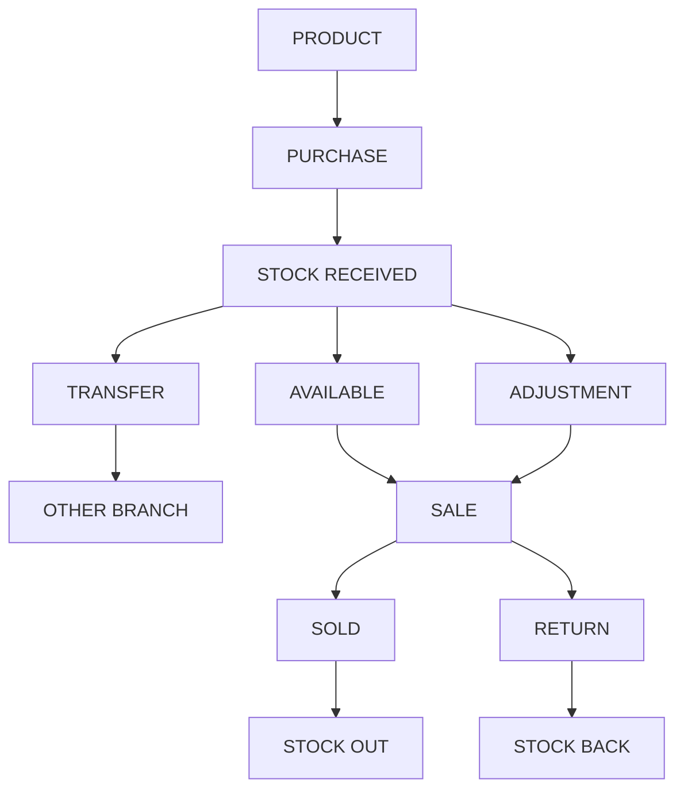
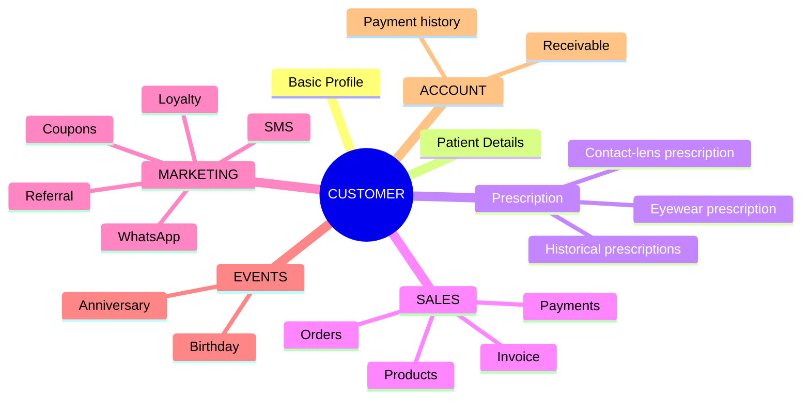
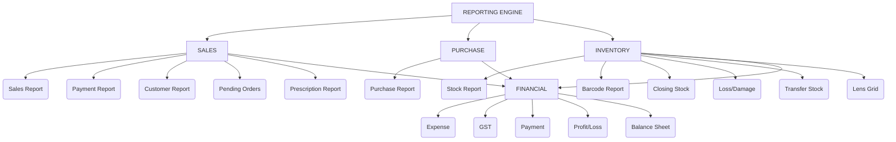

# Optical CRM - Core Architecture Blueprint

This blueprint maps out the core data architecture, module taxonomy, and business logic workflows for the Optical CRM.

## 1. Enterprise Module Taxonomy

The entire system is categorized into 9 distinct macro-modules that govern the application.

---

## 2. High-Level Data Flow Architecture

The system is driven by three primary foundational pillars that converge into operational workflows and ultimately feed into the financial accounting engine.

---

## 3. Core Operational Cascade (The Supply Chain Flow)

This represents the strict linear flow of goods and money through the system, from creation to final accounting.

---

## 4. The Clinical-to-Retail Workflow (Sales & Prescription Flow)

This flow details the exact data structure required when a Customer receives a Prescription and converts it into a Sales Order for a Frame and Lens.

---

## 5. The Inventory Lifecycle Workflow

This flow maps the precise states of stock movement through the system, from initial receipt to final disposition.

---

## 6. Detailed Entity Models

### A. The Comprehensive Customer Entity
The Customer is the central hub for all outward-facing business operations, marketing, and clinical history.

### B. The Product Entity
The Product is the central hub for all supply chain and inventory operations.

*   **Supply Chain:** Purchase, Stock Transfer, Vendor Returns
*   **Operational:** Inventory Tracking, Barcode Generation
*   **Transactional:** Sales
*   **Analytics:** Product-specific Reports

---

## 7. Enterprise Reporting Architecture

The reporting module aggregates data from the three main operational branches (Sales, Purchase, Inventory) and feeds them into the overarching Financial reports.

