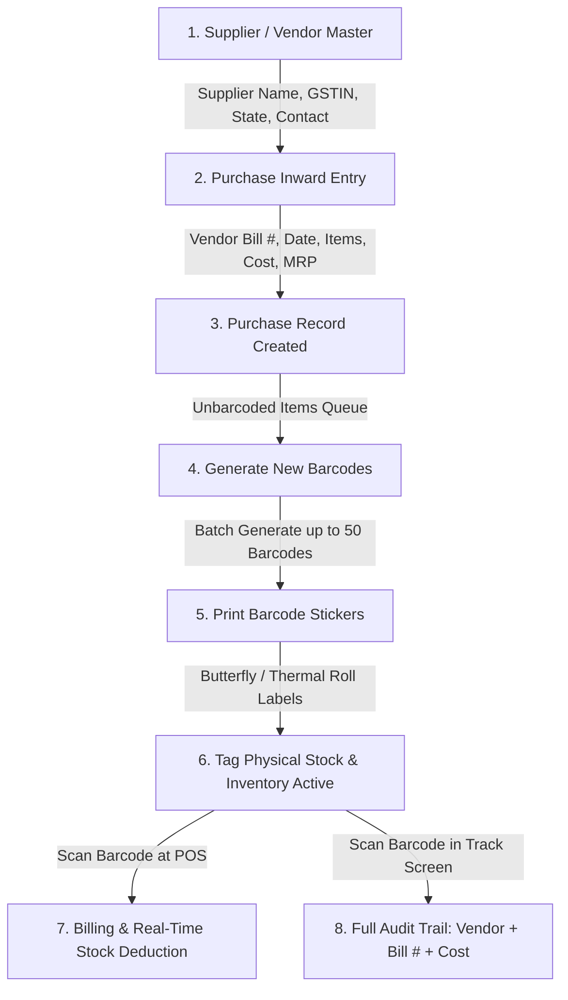

# Reference CRM Workflow: Vendor -> Purchase -> Barcode -> Product

**Reference System Target:** https://india.opticalcrm.com/  
**Source Pages Crawled:**
- `page=purchase-add` (Add Purchase / Inward Bill)
- `page=purchase-generate-barcode` (Generate New Barcode)
- `page=purchase-print-barcode` (Print Barcodes)
- `page=master-supplier-add` (Supplier / Vendor Master)
- `page=master-purchase-code-settings` (Purchase & Product Code Settings)
- `page=master-barcode-settings` (Barcode & Label Settings)
- `page=inventory-track-barcode` (Track Barcode)
- `page=inventory` (Inventory Levels)

---

## Complete Business Workflow Breakdown

---

## Detailed Step-by-Step Analysis

### 1. Supplier / Vendor Setup
- **Access:** `Master Settings -> Suppliers` or via the **`+`** inline button in `Add Purchase`.
- **Fields Captured:**
  - `Supplier Company Name` (e.g., `METRO OPTICALS`, `LUXOTTICA`, `ESSILOR`, `BAUSCH & LOMB`)
  - `Contact Name` (Sales representative)
  - `Contact Number` (Mobile / Phone)
  - `GST Number` (15-character GSTIN)
  - `State` (Dropdown to determine intra-state CGST+SGST vs inter-state IGST)

---

### 2. Purchase Inward Entry (`page=purchase-add`)
- **Bill Information (Header):**
  - `Supplier Name` (Dropdown with search + inline `+` to add new supplier)
  - `Purchase Bill Number` (Vendor's tax invoice number, e.g., `INV/2026/0491`)
  - `Branch Name` (Select branch receiving goods)
  - `Purchase Date` (Defaults to today)
  - `Tax Rule` (GST tax rate)
- **Item Rows:**
  - `Product Type` (Frame, Sunglasses, Lens, Contact Lens, Solution, Other, Non-Chargeable)
  - `Product Code` / Barcode:
    - If product arrives with an existing manufacturer barcode (e.g. contact lenses, solutions, branded sunglasses), the vendor barcode is scanned here.
    - If it is an unbarcoded optical frame, an internal SKU/Product Code is entered or generated.
  - `Details`: Auto-concatenated or entered description (e.g. `renu 60ml - Bausch Lomb`, `Ray-Ban RB3025 Aviator Gold`).
  - `Unit Price` & `Purchase Price`: Cost price per unit (exclusive/inclusive of tax).
  - `Qty`: Number of pieces received (for Contact Lens, entered per box; system auto-divides per piece).
  - `Retail Price (MRP)`: Printed sticker MRP.
  - `Total Purchase Price`: Auto-calculated `(Qty * Purchase Price)`.
- **Actions:**
  - `Save As Draft ->`
  - `Add Purchase ->`

---

### 3. Generate New Barcode (`page=purchase-generate-barcode`)
In the reference CRM, newly inwarded purchase goods are held in a **pending barcode generation pool**:
- **Filters:** Branch Name, Product Type (`All`, `Frame`, `Lens`, etc.), Search By Purchase Bill Number or Supplier.
- **Table Columns:**
  - Checkbox (allows selecting up to 50 items at a time)
  - `Branch Name`
  - `Purchase/Challan/Import Details`:
    - `Purchase Date` (e.g., `13-07-2026`)
    - `Purchase Bill Number` (e.g., `02`)
    - `Supplier` (e.g., `METRO OPTICALS`)
  - `Product Type` (e.g., `Solution`, `Frame`)
  - `Product Details` (`Product Code: GL25055`, `Description: renu 60ml - Bausch Lomb`)
  - `Price`: Purchase Price (`Rs 155.00`), Sales Price (`Rs 170.00`)
- **Execution:** User checks items and clicks **`Generate Barcode Number ->`**.
  - The system creates distinct unique barcode strings for every piece.

---

### 4. Barcode Printing & Label Settings
- **Label Configurations:**
  - **Butterfly / Dumbbell Labels:** Specialized optical frame tags (e.g., 90x12 mm or 100x15 mm) with narrow non-adhesive tails that loop around the frame bridge or temple.
  - **Rectangular Thermal Stickers:** (e.g., 50x25 mm or 38x25 mm) for contact lens boxes and lens packaging.
- **Fields printed on sticker:**
  - Store / Branch Name
  - Brand & Model Name
  - Barcode Graphic + String (CODE128)
  - MRP (Rs) & Selling Price (Rs)
  - Frame Parameters: Size (e.g., `52-18-140`), Color, Shape
  - Lens Parameters: SPH, CYL, AXIS, ADD

---

### 5. Barcode Tracking (`page=inventory-track-barcode`)
- Allows quick scanning of any physical barcode in the shop.
- Instantly displays complete provenance:
  - Which **Supplier / Vendor** supplied the item
  - **Purchase Bill Number** and Purchase Date
  - Original Purchase Cost (₹)
  - Current Status: `In Stock (Branch: Eye Style Opticals)` OR `Sold (Invoice: #INV-1092, Date: 20-08-2026)` OR `Transferred`.

---

### 6. Product Code Settings (`Master Settings -> Purchase & Product Code Settings`)
- Configures how product codes are structured:
  - Purchase Price Source: `From Product Code` vs `From Purchase History`.
  - Duplicate codes allowed with same parameters: Yes / No.
  - Show GST % and HSN in Product Code.
  - Configurable parameters per category that combine into the Product Code.
